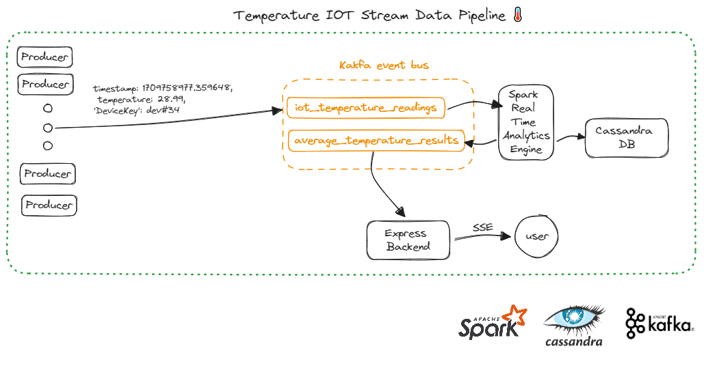

# IoTDataPipeline

## Introduction

This project demonstrates the powerful combination of Kafka, a preferred tool for solution architects, and data analytics platforms to transition from batch processing to real-time or near-real-time data processing solutions.

Designed as part of a blog series, this repository aims to assist individuals currently facing challenges with batch processing infrastructures, offering insights into transitioning to more dynamic, real-time analytics solutions. For more information, refer to our [blog series](https://www.vairix.com/tech-blog).

## Overview

IoTDataPipeline is a compact yet insightful project that showcases real-time data ingestion, processing, and visualization, leveraging a stack of well-integrated technologies. It's a perfect starting point for those looking to understand the nuts and bolts of real-time data pipelines in the context of IoT (Internet of Things).



### Components

The project spins up several services using Docker Compose:

- **Zookeeper & Kafka Broker**: Forms the backbone of our messaging system, allowing for robust data ingestion and streaming.
- **Control Center**: A web-based user interface for managing and monitoring Kafka.
- **Spark**: The analytics engine that processes data streams in real-time.
- **Cassandra**: A NoSQL database used to store processed results for future analysis.
- **Express App**: A Node.js application that visualizes the real-time analytics results using Server-Sent Events (SSE).

### Workflow

1. **Data Production**: A Python script (`kafka_producer.py`) simulates IoT device data, producing temperature readings that are sent to a Kafka topic.
2. **Data Processing**: Spark (`spark_stream.py`) consumes the temperature readings from Kafka, computes the average temperature per device, and performs dual actions:
   - Streams the results to another Kafka topic for real-time visualization.
   - Stores the results in Cassandra for historical analysis.
3. **Install Python Dependencies**:

    Execute the following command to install the necessary Python packages:

    ```bash
    pip install -r requirements.txt
    ```

4. **Run Spark Streaming Application**:

    Execute the Spark streaming application to start listening to Kafka topics and processing data:

    ```bash
    python spark_stream.py
    ```

5. **Run Kafka Producer**:

    To simulate IoT device data, run the Kafka producer script with the following command:

    ```bash
    python kafka_producer.py -producers=5 -duration=1
    ```
   
    <small style="color:gray;">
    Note: `-producers` specifies the number of IoT devices to simulate, and `-duration` defines the time in minutes for which the script will run before stopping.
    </small>


6. **Start the Backend Server and Visualize Data**:

    Navigate to the backend folder and start the Node.js application:

    ```bash
    node app.js
    ```

Then, open your web browser and go to http://localhost:3000 to view the processed data in real time.


